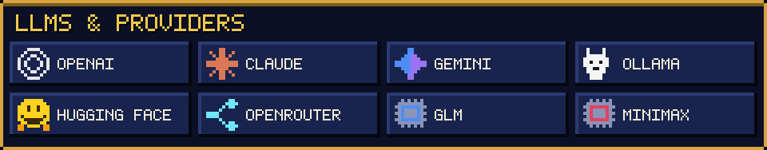
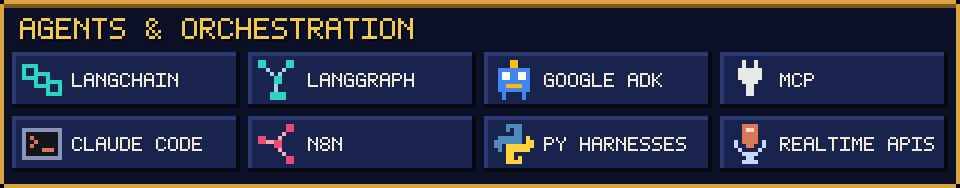
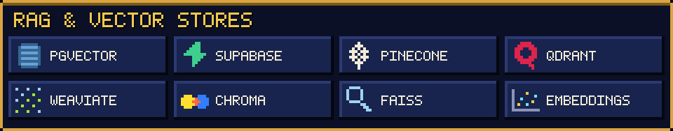
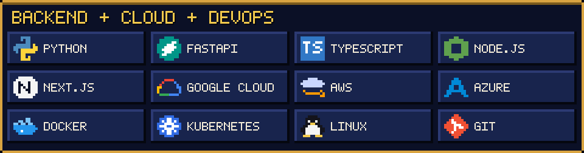
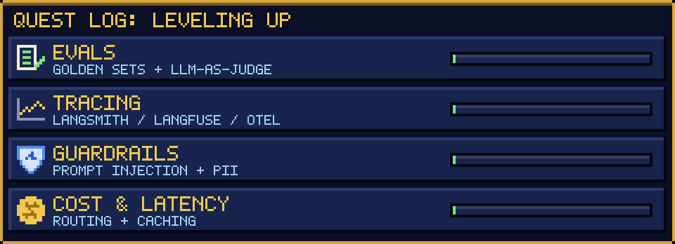

  

  <i>Setting sail on the Grand Line of LLMs, building AI agents that make it to production.</i>

  
  &nbsp;
  

### 🏴‍☠️ &nbsp;Captain's Log

I'm an **AI Engineer** with **2+ years** designing, building and deploying AI agents for companies and clients.
I've worked across the whole stack, from prompts and retrieval to orchestration, tools and cloud infrastructure, and
my focus is getting agents out of the demo stage and into real products.

- ⚓ &nbsp;**Building:** voice agents, multi-agent systems, RAG pipelines and MCP servers
- 🧭 &nbsp;**Based in:** LATAM · Remote · UTC-5
- 🎓 &nbsp;**Background:** Systems Engineering (UTP) · AI program (Samsung Innovation Campus)
- 🌊 &nbsp;**Ask me about:** agent architecture, voice agents, RAG, MCP, and taking agents from prototype to production

### 🍖 &nbsp;Devil Fruit Powers: what I build

| Power | What it means |
| :-- | :-- |
| 🎙️ **Voice Agents** | Real-time conversational agents built on realtime speech APIs |
| 💬 **Conversational Agents** | Chatbots and assistants with memory, tools and business logic |
| 📚 **RAG & Embeddings** | Retrieval pipelines covering chunking, embeddings, vector search and grounding over private data |
| 🕸️ **Agentic Orchestration** | Multi-agent workflows with LangGraph and Google ADK, plus custom Python harnesses |
| 🔌 **MCP Servers & Tools** | Custom Model Context Protocol servers and tool layers that let agents act on real systems |
| 🧩 **AI Integration** | Adding LLMs to existing products, APIs and internal systems |
| ⚙️ **Automation** | Agentic automations and workflows with n8n |

### 🗺️ &nbsp;Log Pose: tech stack

### 📜 &nbsp;Voyage Log

**AI Engineer** · 2+ years · building agents for companies and clients

- Built **real-time voice agents** on realtime speech APIs for natural, low-latency conversations
- Designed **RAG systems** end to end, from ingestion, chunking and embeddings to vector search on pgvector, Pinecone, Qdrant, Weaviate, Chroma and FAISS
- Built **multi-agent orchestration** with LangGraph, Google ADK and custom Python harnesses, including agents modeled on OpenClaw- and Hermes-style architectures
- Developed **MCP servers and custom tools** that let agents read from and act on real business systems
- Integrated LLMs from **OpenAI, Anthropic, Google** and open-source models (Ollama, Hugging Face, OpenRouter, GLM, MiniMax) into existing products
- Shipped agents to production on **Google Cloud** with FastAPI, Docker and Kubernetes

### 🛠️ &nbsp;Shipyard: currently building

Most of my production work is in private repositories for clients and companies. These are the open-source builds I'm working on now:

| Project | What it shows | Stack |
| :-- | :-- | :-- |
| 🎙️ **Realtime Voice Agent** | A phone-style voice agent that calls tools over MCP, with per-turn latency tracking and full traces | Realtime APIs · MCP · FastAPI · Langfuse |
| 📚 **RAG Evals Lab** | Hybrid search with reranking over a document set, plus an eval suite (golden set + LLM-as-judge) that runs in CI | pgvector · LangGraph · Ragas / DeepEval · GitHub Actions |
| 🛡️ **Guarded Multi-Agent Crew** | A multi-agent workflow with guardrails (prompt injection, PII) and model routing to balance cost and latency | Google ADK · LangGraph · OpenRouter · Cloud Run |

 

### 🐌 &nbsp;Den Den Mushi: get in touch

Want to talk about agents, LLMs or a project? Reach out on [LinkedIn](https://www.linkedin.com/in/anthony-rivera-i/) or by email at **anthony.g.rivera.i@gmail.com**.

 

